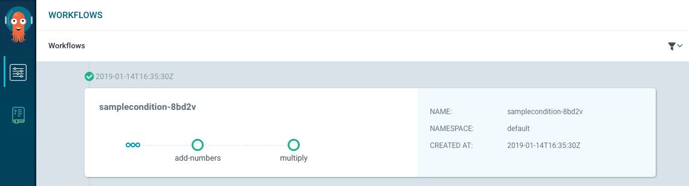
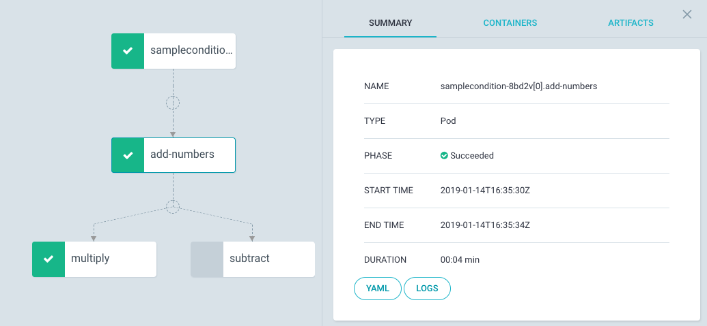

# argo-workflows
Kubernetes workflows to be executed on ArgoCD

For Details about Argo: https://argoproj.github.io/

## Sample Condition Workflow

### Steps:
* Adds two numbers
* Multiplies or subtracts based on condition check

### High Level Workflow view:

### Detailed Workflow view:

